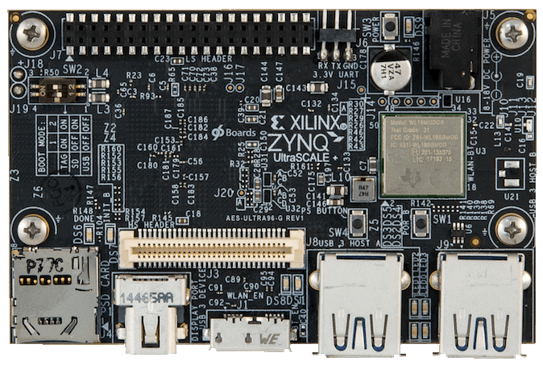
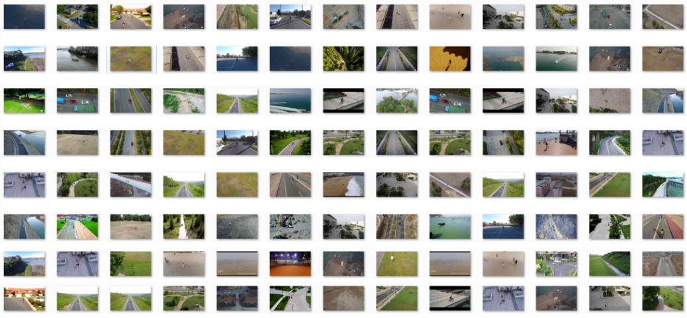
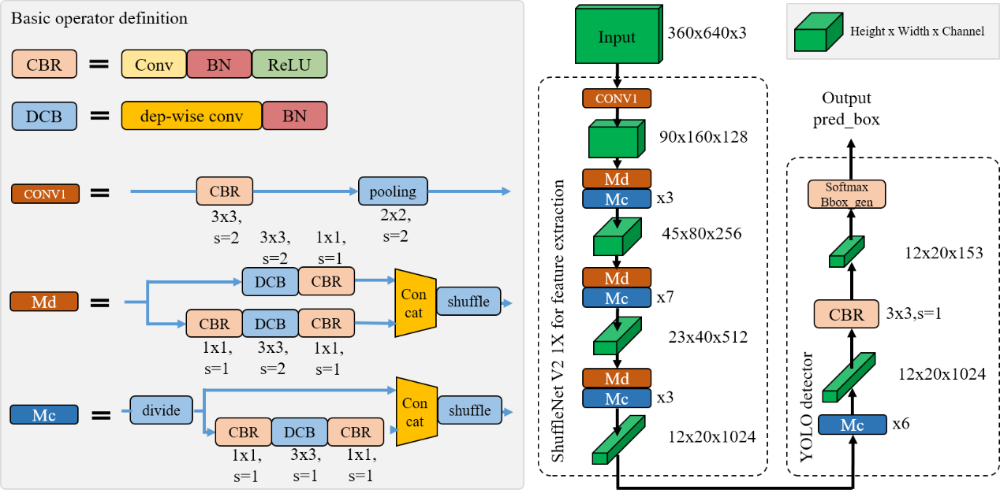
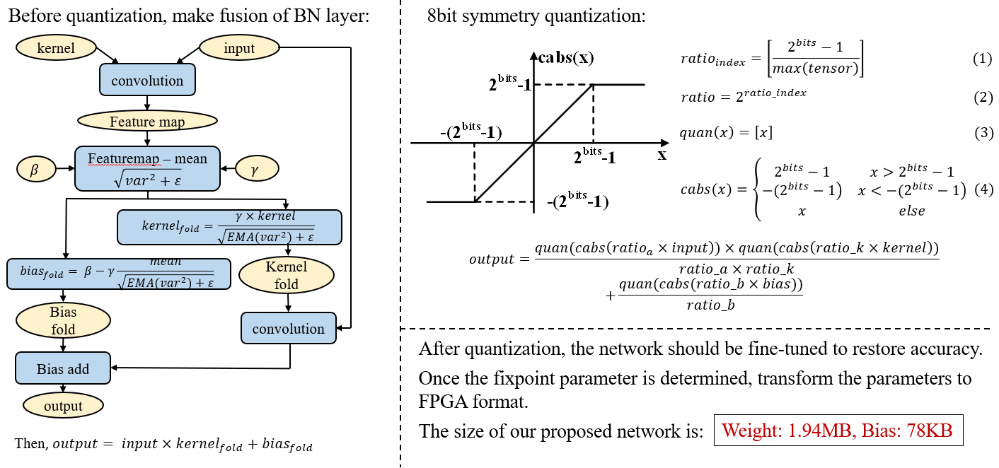
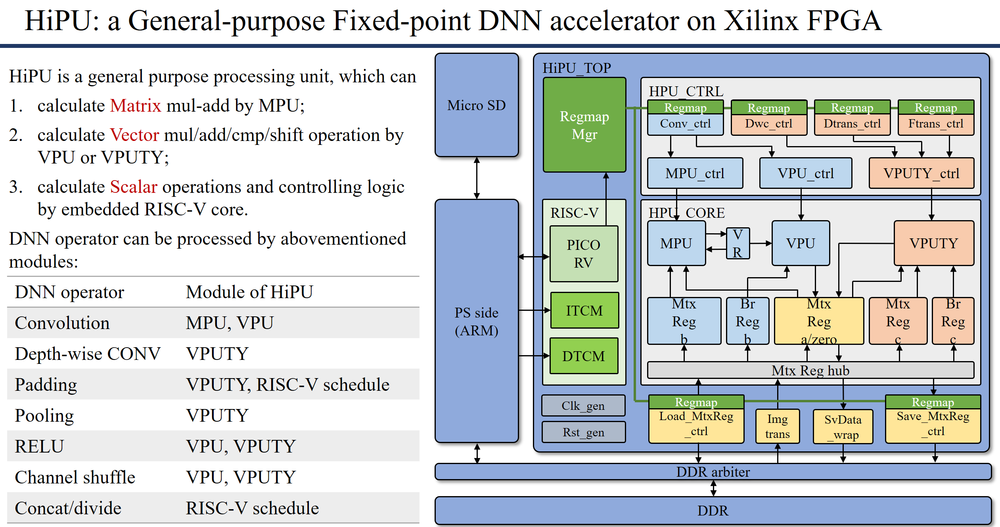
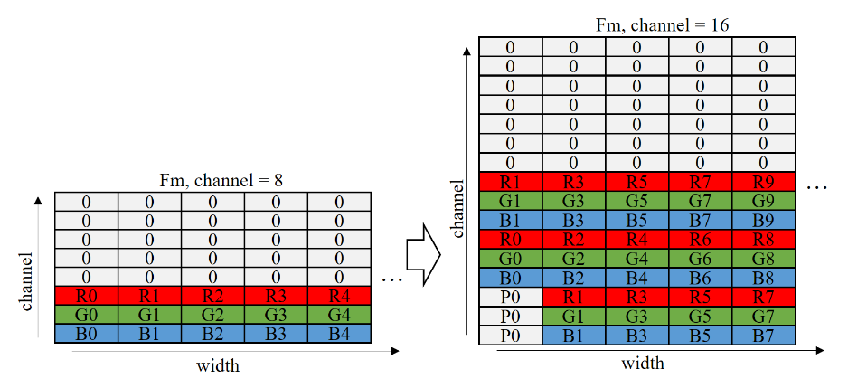

XJTU-Tripler design in DAC19 Conference System Design Competition (SDC)
-------------------------------------------------------------------------------------
The 2nd place winner's source codes for DAC 2019 System Design Contest, FPGA Track. Designed by
>XJTU-Tripler Group, Institute of Artificial Intelligence and Robots, Xi’an Jiaotong University 

>Boran Zhao, Wenzhe Zhao, Tian Xia, Fei Chen, Long Fan, Pengchen Zong,Yadong Wei, Zhijun Tu, Zhixu Zhao, Zhiwei Dong, 
and Pengju Ren*

>pengjuren@xjtu.edu.cn

>2019-06-21

The Design Automation Conference, is one of the world's most prestigious
conference in EDA. The 56th DAC Conference was held in Las Vegas. Among them, the 
System Design Contest (SDC) aim at fast target detection for Edge-side 
devices. The competition was sponsored by Xilinx, DJI and Nvidia. The single target
training data set include 90,000 images with resolution of 360x640,and the system 
test on 50,000 images. The accuracy IoU (Intersection over Union) higher and the 
energy consumption lower is the winner.

A team can choose the NVIDIA TX2 or Xilinx Ultra96 as design platforms. Our team 
participated in the FPGA track. The Ultra96 is an excellent ZYNQ development 
board designed for low-power IoT environments.The Ultra96's PS side is equipped 
with a quad-core ARM Cortex-A53 CPU running at 1.5GHz;the software can be developed 
using the Python-based PYNQ framework. The Ultra96 board and the PL side resources
are shown in the figure below.

| PL resource of ZU3 |      |
|--------------------|------|
| LUT                | 70K  |
| FF                 | 141K |
| BRAM               | 216  |
| DSP                | 360  |
  
  ZU3 Resource

Figure 1 Introduction to the FPGA development environment provided by Xilinx

1.Motivation
----------

In order to achieve a balance between detection accuracy and energy consumption,
our team selected and optimized a lightweight neural network framework for the
edge side. And for the resource limitation of ZU3, we simplified a DNN
accelerator (HiPU) designed to support the general network anddeployed it on 
the PL. The main work have two parts:
on the one hand, algorithm optimization, on the other hand, hardware architecture-HiPU:

**The algorithm optimization mainly includes:**

1) Select ShuffleNet V2 as the main frame for feature extraction;

2) Select YOLO as the regression framework for the single target detection;

3) Perform 8-bit quantization on the neural network.

**The HiPU design feature:**

1) Support CONV, FC, Dep-wise CONV, Pooling, Ele-wise Add/Mul, etc.the peak power 
is 268Gops, the efficiency is greater than 80%;

2) Supports Channel shuffle, divide, and concat operations without consuming
extra time;

3) Provide C, RISC-V assembly interface API;

4) The HiPU is completely implemented in PL and does not depend on the
PS. The main PS workload is image reading and result output.

the performance on the dataset of the testing set: the accuracy rate IoU is 61.5%;
the energy consumption was 9537J, the image process speed was 50.91 Hz, and the power was
9.248W.

2.Algorithm framework design
----------------------------

### 2.1 Task Analysis

The dataset is provided by DJI, and some of the pictures are shown below. 
Before determining the algorithm, our team first analyzed the 
characteristics of the training data set:

1) The image size is 360x640, no need to resize for the following process;

2) All test pictures are from the UAV perspective. The size of the BBOX size
varies from 36 pixels to 7200 pixels, and the algorithm needs to support
difference shape BBox;

3) All pictures are in 12 categories (95 sub-categories), including boat (7),
building (3), car (24), drone (4), group (2), horse-ride(1), paraglider(1) ),
person (29), riding (17), truck (2), wakeboard (4), whale (1) category. 

4) Even if multiple similar targets appear in one test image, the BBox must 
assigned a fixed target. That is, an appropriate over-fitting is required for training.

Figure 2 Part of the picture of the training set

### 2.2 Single target detection network selection

In order to meet the real-time detection on the mobile device, our team
finally selected YOLO as the basic detection algorithm. Replace the feature
extraction network with the lightweight ShuffleNet V2. As shown in the figure below, 
we have customized our single target detection network,called ShuffleDet.

Figure 3 ShuffleDet Structure

### 2.3 Training and quantification of neural networks

Our team first pre-trained a standard ShuffleNet V2 classification network on
the ImageNet dataset. After the model converges, the parameters of the feature
extraction part are migrated to the ShuffleDet network. Use the DAC training set
to train the parameters of other layers.

In order to adapt to the fixed-point operation on FPGA, after the whole
parameter training is completed, all parameters need to be quantized. Our team
quantified both network parameters and feature maps to 8bit. The quantization process 
is mainly divided into the following steps:

1) merging the BN layer into the parameters;

2) symmetrically quantifying the combined parameters;

3) if the quantized parameters are used directly, the precision loss is too
serious. Therefore, after quantification, you need to fine tune the parameters.
A schematic diagram of the quantization operation is shown in the figure below.

Figure 4 Quantification process of network parameters

After quantification, the ShuffleDet network we used has a convolutional layer
of about 74 layers, a weight of about 1.94MB, and a Bias of about 78KB.

3.hardware architecture-HiPU
------------------------------------------

###  3.1 HiPU introduction

Since the HiPU designed is mainly for the application specific
integrated circuit (AISC), the design implementation on the FPGA is mainly to
verify the function. Therefore, for the computing platform provided by the game,
we need to make appropriate tailoring needs to adapt to the resources of ZU3.
The following figure shows the tiny HiPU design block diagram and its
characteristics. The HiPU operates at 233MHz and its peak power is 268Gops. With
C/RISC-V assembly as the programming interface, the convolution efficiency
averages over 80%.

Figure 5 HiPU structure block diagram and characteristics

HiPU supports a variety of common NN operations, including: CONV, FC, Dep-wise
CONV, Pooling, Ele-wise Add/Mul and other operations. FC can also achieve nearly
100% computational efficiency.

HiPU supports shuffle, divide, and concat operations in the channel direction.
When these operations are immediately after the convolution operation, they can
be merged on the hardware without consuming additional time.

HiPU can work on any kind of Xilinx FPGA and is not limited by the Zynq
architecture.

The HiPU support matrix operations, vector operations, and scalar
operations. Any type of parallel computing can be supported in the case of
scheduling. In the future, optimization of sparse matrix operations will be
implemented to support efficient DeCONV operations and feature map sparse
optimization.

### 3.2 HiPU optimization point analysis

1) Reduce the required DDR bandwidth by inter-layer cascading

HiPU design performance has two important aspects: one is the utilization of the
MAC unit; the other is whether the data transmission network can match the data
required. Most of the limitations of the data transmission network
come from the DDR interface. This design is specifically optimized for the DDR
interface.

Due to the size limitation of the SRAM in the HiPU, it is impossible to
completely place the data of one layer of feature map in the SRAM of the HiPU.
In the usual calculation order, the feature map calculation result of each layer
needs to be returned to the DDR for storage. In this way, the feature map data
of each layer needs a DDR access, the bandwidth requirement for DDR is very
large, and it consumes additional power consumption.

Our team reduces the bandwidth requirements of DDR by cascading between layers.
Using ShuffleNet's bottleneck as a unit, some row of feature maps is read from
the DDR at the input of each bottleneck. After all the layers are calculated in
turn, the output feature map is written back to DDR.The following figure shows
the order of cascading calculation of Module C.

Figure 6 Module-C uses inter-layer cascade calculation

2) Input image format conversion to improve processing efficiency

HiPU calculates 8 input channels in parallel at a time. However, the first layer
of the network input image has only 3 channels of RGB, resulting in a HiPU
calculation efficiency of only 3/8. Therefore, our team designed a conversion
module for the input image. If the width of Conv1's kernel is 3, the channel of
the input image is expanded from 3 to 9. Eventually, the processing efficiency
of the first layer was increased from 0.38 to 0.56, and the conversion diagram
is shown in the figure below.

Figure 7 Conversion of the input image in the row direction
###  3.3 System optimization design
1) Image decoding and convolutional neural network computing parallelization

Since HiPU only relies on the resources of the PL, the resources on the PS side 
can be freed to do system IO related work. When the team processes the detection 
operation of the current picture, it pre-reads and decodes the next picture on 
the PS side to improve the parallelism of the processing, thereby increasing 
the overall detection frame rate from 30.3 Hz to 50.9 Hz.

The figure below shows a schematic diagram of parallelization of image decoding
and convolutional neural networks.

(a) Workflow before parallelization

(b) Workflow after parallelization

2) Use C code to speed up the original Python code on the PS side

Reconstructing the PS python operation with c : 1)Precalculate the address pointer 
of the confidence and BBox coordinates in the PL side data; 2) Find the largest 
Confidence and the coordinates of the corresponding BBox , and then calculate 
the absolute coordinates based on the relative coordinates;

3) Use the gated clock to reduce the energy consumption

In order to reduce the energy consumption of the system, a gated clock strategy
is designed. When the HiPU calculates a picture, it automatically turns off the
clock, and then activates the clock when the next picture starts counting.
Setting this strategy is based on two main reasons:

First of all, the time for the system to solve the jpg format picture is not
fixed. When the SD card speed clase is not fixed, the average time is between
7ms-12ms, and the maximum resolution time of some pictures can reach 100ms;

Secondly, the system's power consumption measurement process and other overheads
will take up part of the CPU time, and the PS and PL share the DDR bandwidth,
which causes the HiPU to reach about 50hz at 166Mhz, but when the HiPU is
increased to 200Mhz, the system The processing frame rate remains at around
50hz.

The above two reasons will cause the HiPU processing time and the picture jpeg
solution time matching to become unfixed; when the HiPU processing image time is
shorter than the image solving time, the HiPU will waste energy by "running
empty".

4.Analysis of competition results
----------------------------------

The following table shows the results of the DAC19 competition. A total of 58
teams worldwide registered for the FPGA contest, but only 11 teams submitted the
design (19% completion rate), compared with 52 teams on the GPU track. There are
16 teams submitting designs (30.8% completion rate), which can also reflect the
difficulty of FPGA design. In the end, our team won the second place. The
champion is iSmart3, which is jointly organized by UIUC, IBM and Inspirit IoT,
and the third runner-up is SystemsETHZ from ETH Zurich. Through communication
with other teams, our team uses the largest network of neural networks. The
advantage is the high-performance DNN accelerator. Unfortunately, the
optimization of the algorithm is not in place. The final results are as follows:

| DAC19 system design competition ranking |                |                |               |                 |          |
|-----------------------------------------|----------------|----------------|---------------|-----------------|----------|
| **Team Name**                           | **IoU**        | **Power (mW)** | **FPS**       | **Total Score** | **Rank** |
| iSmart3                                 | 0.716          | 7260           | 25.05         | 1.526           | 1        |
| **XJTU_Tripler**                        | **0.615**      |**9248**        | **50.91**     |**1.394**        | **2**    |
| SystemsETHZ                             | 0.553          | 6685           | 55.13         | 1.318           | 3        |
| Comparison of resources                 |                |                |               |                 |          |
| **Team Name**                           | **Programing** | **LUTs**       | **Flip-flop** | **BRAM**        | **DSP**  |
| iSmart3                                 | HLS            | 83%            | 55%           | 95%             | 94%      |
| **XJTU_Tripler**                        | **Verilog**    | **65%**        | **41%**       | **91%**         | **98%**  |
| SystemsETHZ                             | HLS            | 77%            | 53%           | 85%             | 73%      |

The ShuffleDet algorithm we designed is also deployed on the TX2 platform. The
following table compares the two. It can be seen that the 8bits quantization
resulted in an IoU loss of 0.056 (-8.3%), but resulted in a frame rate increase
of 28.87 (+131%) and an energy reduction of 8309J (-46.56%).

Performance comparison of ShuffleDet on TX2 and Ultra96 FPGA platforms

| **Platform** | **FPS** | **IoU** | **Energy(J)** |
|--------------|---------|---------|---------------|
| TX2          | 22.04   | 0.671   | 17846.115     |
| Ultra96      | 50.91   | 0.615   | 9537          |

5.Demonstration of XJTU-tripler
--------------------------------

Our demos have been uploaded to video repository. You can find them from below link:

[Dual-channel real time detection with DAC19 training set](https://www.bilibili.com/video/av55982436/)

[Object detection & tracking from UAV](https://www.bilibili.com/video/av55971956/)

[Cooperative navigation of UAV and UGV](https://www.bilibili.com/video/av55966162/)

[Cooperative topological navigationsystem of UAV and UGV](https://www.bilibili.com/video/av55972226/)
